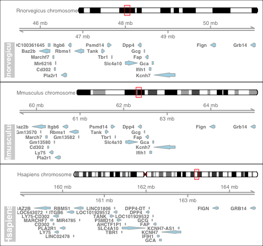

# Abstract
`SyntenyViz` is a R package that define an analysing pipeline that enable visualising the synteny conservation across species.  `SyntenyViz` enables not only intuitive examination of synteny features and facilitates reconstruction effort of ancestral genomes, but also allows more direct interrogation of gene regulations and gene structures within a gene cluster.

# Introduction
A gene is the most basic inheritable functional unit in biology. An eukaryotic organism typically possesses a large number of protein coding genes ranging from few thousands to 30 thousands. [@pray2008eukaryotic] Genes in an organism tend to self-organise into clusters, synteny describes this physical arrangement and distribution of genetic loci on the chromosome.

Several studies have demonstrated the gene structures evolve in a gradual, chronological fashion and largely independent to coding gene evolution. [@Jaillon2004; @Mulley2004; @SONG2004459; @Yandell2006; @KAWASHIMA2019257] However, there is a tendency for genes that are co-localised in a close proximity conserve its gene structures throughout evolution. In eukaryotes for incident, synteny and linkage are often conserved for an extended period of time. Although human and mouse diverged 75 million years ago, a recent study by @KAWASHIMA2019257 demonstrated that many synteny blocks are conserved in both species. Study the information of synteny conservation also provides us tools to analyse complex genome functions, as synteny conservation will likely to allow us to study gene functions in a simpler, model organism and infer to a more complex one.

Visualising the synteny within species and across species can enable intuitive examination of gene structures and conservation across species, which in turn offer not only unique insights and facilitates reconstruction effort of ancestral genomes, but also allow more direct interrogation of gene regulations and gene loci co-localisation within a gene cluster.

`SyntenyViz` is a R package that not only allow direct extraction and annotation of full synteny blocks with extensive transcriptomics evidence from 13 organisms (as version 0.0.0.9000 stands), but also offers visualisation functions to plot both single and multiple synteny graphs with ease.

# Methods
`SyntenyViz` encapsulates a workflow to extract and annotate synteny from a given organism and target gene range. As in current release (i.e. v0.0.0.9000), 13 organisms can be examined on (detail can be explored via `orgmOrgDB` after loading the package).

Analysing workflow:

1. To define target organism and target range for investigation in the format of _<chromosome_number>:<start>:<end>_.
2. To transform target range into GRange form using function `coordFormat`.
3. To download UCSC transcriptomics evidence databases and annotation databases for target organism(s) using function `getPkgs`
4. __Optional Step:__ To generate annotated synteny tracks for defined organism around defined range.
5. To synthesise single synteny plot using function `synvizPlot` (as in Figure \ref{fig-Hsplot}).
6. To compare synteny conservation by constructing multi-synteny map on comparing organisms using function `multiplot`.

  1. To construct multi-synteny map, a multi-synteny query will need to be constructed using function `orgmsCollection.init` and `orgmsAdd`.
  1. To construct synteny conservation map for multiple organisms via function `multiplot` (as in Figure \ref{fig-Msplot}).

It is also possible to construct all synteny graph (single and multi) using a single function `multiplot` as long the multi-synteny query is defined.

# References
